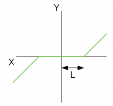

<!--
  Copyright (c) 2026 Hans Mühlbauer, Franz Höpfinger and others.

  This program and the accompanying materials are made available under the
  terms of the Eclipse Public License 2.0 which is available at
  https://www.eclipse.org/legal/epl-2.0

  SPDX-License-Identifier: EPL-2.0
-->

## Type	Function module

| | |
|:---|:---|
| **Input	X** | REAL (input) |
| **T** | TIME (time delay of the lowpass) |
| **KL** | REAL (gain of the filter) |
| **LM** | REAL (maximum value of the HF amplitude) |
| **Output	Y** | REAL (output value) |
| **L** | REAL (amplitude of high frequency) |
| | DEAD_BAND_A is a self adapting linear transfer function with dead zone. The function moves the positive part of the curve to -L and the negative part of the curve by +L. DEAD_BAND_A is used to filter the noise components at the origin of a signal. DEAD_BAND_A, for example, used in control systems in order to prevent that the controller permanently switches in small increments, while the actuator is overstressed and worn out. |
| | The size L is calculated by filtering the HF cpmponents of the input signal X using a low pass with time constant T and the dead zone L calculated from the amplitude of the HF portion. The sensitivity of the device can be changed via the parameter KL. KL is predefined to 1 and can be unconnected. Reasonable values for KL are between 1 - 5. |
| | L = HF_Amplitude(effective)   *KL. |
| | So that the module will remain stable even under extreme operating conditions, the input LM is limited by of the maximum value of L. |
| | DEAD_BAND  = X - SGN(X)*L if ABS(X)> L if ABS(X) > L |
| | DEAD_BAND  = 0 if ABS(X) <= L |

