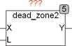

<!--
  Copyright (c) 2026 Hans Mühlbauer, Franz Höpfinger and others.

  This program and the accompanying materials are made available under the
  terms of the Eclipse Public License 2.0 which is available at
  https://www.eclipse.org/legal/epl-2.0

  SPDX-License-Identifier: EPL-2.0
-->

## Type	Function module

| | |
|:---|:---|
| **Input	X** | REAL (input) |
| **L** | REAL (  Lockout  Value) |
| **Output	Y** | REAL (output value) |
| | DEAD_ZONE2 is a linear transfer function with dead zone and hysteresis. The output equals the input signal when the absolute value of the input is greater than L. |
| | DEAD_ZONE2 = X if ABS (X) > L |
| | DEAD_ZONE2 = + / - L if ABS (X) <= L |

