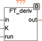
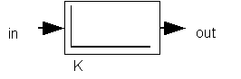

<!--
  Copyright (c) 2026 Hans Mühlbauer, Franz Höpfinger and others.

  This program and the accompanying materials are made available under the
  terms of the Eclipse Public License 2.0 which is available at
  https://www.eclipse.org/legal/epl-2.0

  SPDX-License-Identifier: EPL-2.0
-->

## FT_DERIV

| | |
|:---|:---|
| **Type** | Function module |
| **Input	IN** | REAL (input signal) |
| **K** | REAL (multiplier) |
| **RUN** | BOOL (enable input) |
| **Output	OUT** | REAL (derivation of the input signal K *X/  T  ) |
| | FT_DERIV is a D-link, or LZI-transfer element, which has a differentiating transfer behavior. At the output of FT_DERIV the derivative is over time T in seconds. When the input signal increases in one second from 3 to 4 then the output 1 * K (K *    X /   T = 1 * (4-3) / 1 = 1 |
| | In other words, the derivative of the input signal, the instantaneous slope of the input signal. With the input RUN the FT_DERIV can be enabled or disabled. FT_DERIV works internally in microseconds and fulfill also the requirements  of very fast PLC controller with cycle times under a millisecond. |
| **Structure diagram** |  |

