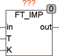
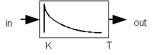

<!--
  Copyright (c) 2026 Hans Mühlbauer, Franz Höpfinger and others.

  This program and the accompanying materials are made available under the
  terms of the Eclipse Public License 2.0 which is available at
  https://www.eclipse.org/legal/epl-2.0

  SPDX-License-Identifier: EPL-2.0
-->

## Type	Function module

| | |
|:---|:---|
| **Input	IN** | REAL (input signal) |
| **T** | TIME (time constant) |
| **K** | REAL (multiplier) |
| **Output	OUT** | REAL  (High pass  with time constant T  ) |
| | FT_IMP is a high-pass filter with time constant T and multiplier K. An abrupt change at the input is visible at the output, but after the time T the value is already smoother by 63% and after 3 * T by 95%. Thus, after an abrupt change of the input signal from 0 to 10, the output passes 10 at the beginning and reduces after 1* T  to 3.7  and after 3 * T to 0.5 and then gradually to 0. |
| **Structure diagram** |  |

