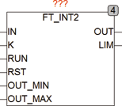

<!--
  Copyright (c) 2026 Hans Mühlbauer, Franz Höpfinger and others.

  This program and the accompanying materials are made available under the
  terms of the Eclipse Public License 2.0 which is available at
  https://www.eclipse.org/legal/epl-2.0

  SPDX-License-Identifier: EPL-2.0
-->

## Type	Function module

| | |
|:---|:---|
| **Input	IN** | REAL (input signal) |
| **K** | REAL (multiplier) |
| **RUN** | BOOL (enable input) |
| **RST** | BOOL (Reset input) |
| **OUT_MIN** | REAL (lower output limit) |
| **OUT_MAX** | REAL (upper output limit) |
| **Output	OUT_MAX** | REAL (upper output limit) |
| **LIM** | BOOL (TRUE if the output is at a limit) |
| | FT_INT2 is an integrator module  which calculates internal with double-precision and ensures a resolution of 14 decimal places. This makes it suitable to use FT_INT2 unlike FT_INT, for power meters and similar applications. |
| | For example, an input signal of 0.0001 results in a sampling time of 1 millisecond and an output value of 100000 a value of 0.0001 * 0.001 seconds = 0.000001. To be added to the baseline of 100000, which results inevitably reflect the value of 100000 because the resolution of the data type Real can only collect up to 8. FT_INT2 solves this problem by calculating internal with double-precision (14 decimal places) and adds even the smallest input values so that no information is lost. |

