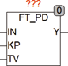

<!--
  Copyright (c) 2026 Hans Mühlbauer, Franz Höpfinger and others.

  This program and the accompanying materials are made available under the
  terms of the Eclipse Public License 2.0 which is available at
  https://www.eclipse.org/legal/epl-2.0

  SPDX-License-Identifier: EPL-2.0
-->

## Type	Function module

| | |
|:---|:---|
| **Input	IN** | REAL (input signal) |
| **KP** | REAL (proportional part of the controller) |
| **TV** | REAL (reset time of the differentiator in seconds) |
| **Output	Y** | REAL (output of the controller) |
| **FT_PD is a PD controller, the following formula works** |  |
| | Y = KP * (IN + DERIV(IN)) |
| | FT_PD can be used in conjunction with the modules CTRL_IN and CTRL_OUT to establish a PD controller. |
| **The following graph illustrates the internal structure of the controller** |  |

