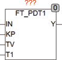

<!--
  Copyright (c) 2026 Hans Mühlbauer, Franz Höpfinger and others.

  This program and the accompanying materials are made available under the
  terms of the Eclipse Public License 2.0 which is available at
  https://www.eclipse.org/legal/epl-2.0

  SPDX-License-Identifier: EPL-2.0
-->

## Type	Function module

| | |
|:---|:---|
| **Input	IN** | REAL (input signal) |
| **KP** | REAL (proportional part of the controller) |
| **TV** | REAL (reset time of the differentiator in seconds) |
| **T1** | REAL (T1 of the PT1 element in seconds) |
| **Output	Y** | REAL (output of the controller) |
| **FT_PDT1 is a PD controller with a T1 link in the D-term. The device operates as follows** |  |
| | Y = KP * (IN + PT1(DERIV(IN)) |
| | FT_PDT1 can be used in conjunction with the modules CTRL_IN and CTRL_OUT and other regulatory technical modules to build complex control circuits. |
| **Internal structure of the block** |  |

