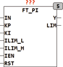
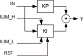

<!--
  Copyright (c) 2026 Hans Mühlbauer, Franz Höpfinger and others.

  This program and the accompanying materials are made available under the
  terms of the Eclipse Public License 2.0 which is available at
  https://www.eclipse.org/legal/epl-2.0

  SPDX-License-Identifier: EPL-2.0
-->

## Type	Function module

| | |
|:---|:---|
| **Input	IN** | REAL (input signal) |
| **KP** | REAL (proportional part of the controller) |
| **KI** | REAL (integral part of the controller) |
| **ILIM_L** | REAL (lower limit of the integrator output) |
| **ILIM_H** | REAL (upper limit of the integrator output) |
| **IEN** | BOOL (  Enable  for  Integrator  ) |
| **RST** | BOOL (asynchronous reset input) |
| **Output	Y** | REAL (output of the controller) |
| **LIM** | BOOL (TRUE if the output has reached a limit) |
| **FT_PI is a PI controller which works following the formula** |  |
| | Y = KP * IN + KI * INTEG(IN) |
| **The input values ILIM_H and ILIM_L limits the working area of the internal integrator. With RST, the internal  Integrator  can always be set to 0. The output LIM indicates that the   Integrator  has reached one of the limits ILIM_L oe ILIM_H. The PI controller is free running and uses the trapezoidal rule to calculate the integrator for the highest accuracy and optimal speed. The default values of the input parameters are predefined as follows** | KP = 1, CI = 1, ILIM_L= -1E38 and ILIM_H = +1E38. |
| **Anti Wind-Up** | Control modules with Integrator tend to the so-called Wind-Up Effect.  A  Wind-Up  means that the integrator module continuously run again because, for example, the control signal Y is at a limit and the system can not compensate the deviation, which then leads to subsequent transition into the control range until a long and time-consuming dismantling of the integrator value and the scheme only respond delayed. Since the integrator  is only necessary to compensate the deviation for all other control units, and the range of the integrator should be limited with the values of ILIM. The  Integrator  then reaches a  limit  and stops remaining at the last valid value. For other wind-  Up  Action, the  Integrator  can be controlled with the input IEN = FALSE any time  separately, the  Integrator only runs when IEN = TRUE. |
| **The following graph illustrates the internal structure of the controller** |  |
| | FT_PI can be used in conjunction with the modules CTRL_IN and CTRL_OUT to build a PI controller. |

