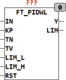
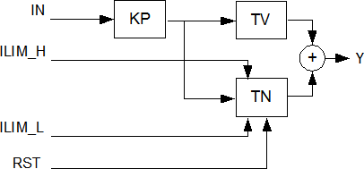

<!--
  Copyright (c) 2026 Hans Mühlbauer, Franz Höpfinger and others.

  This program and the accompanying materials are made available under the
  terms of the Eclipse Public License 2.0 which is available at
  https://www.eclipse.org/legal/epl-2.0

  SPDX-License-Identifier: EPL-2.0
-->

## FT_PIDWL

| | |
|:---|:---|
| **Type** | Function module |
| **Input	IN** | REAL (input signal) |
| **KP** | REAL (proportional part of the controller) |
| **TN** | REAL (past set time of the controller in seconds) |
| **TV** | REAL (derivative of the controller in seconds) |
| **LIM_L** | REAL (lower limit of the integrator output) |
| **ILIM_H** | REAL (upper limit of the integrator output) |
| **RST** | BOOL (asynchronous reset input) |
| **Output	Y** | REAL (output of the controller) |
| **LIM** | BOOL (TRUE if the output has reached a limit) |
| **FT_PIDWL is a PID controller with dynamic Wind- Up reset and works according to the following formula** |  |
| | Y = KP * ( IN + 1/TN * INTEG(IN) + TV *DERIV(IN)) |
| **The control parameters are given in the form of KP, TN and TV, and if there are parameters KP, KI and KD they can be converted using the following formula** |  |
| | TN = KP/KI und TV = KD/KP |
| **The input values LIM_H and LIM_L  limit the range of the output Y. With RST, the internal  Integrator  can always be set to 0. The output LIM indicates that the   Output  Y  runs to one of the limits  LIM_L  orL IM_H. The PI controller is free running and uses the trapezoidal rule to calculate the integrator for the highest accuracy and optimal speed. The default values of the input parameters are predefined as follows** | KP = 1, TN = 1s, TV = 1s,   ILIM_L =-1E38 and ILIM_H = +1 E38. |
| **Anti Wind-Up** | Control modules with Integrator tend to the so-called Wind-Up Effect.  A  Wind-Up  means that the integrator module continuously run again because, for example, the control signal Y is at a limit and the system can not compensate the deviation, which then leads to subsequent transition into the control range until a long and time-consuming dismantling of the integrator value and the scheme only respond delayed. Since the integrator  is only necessary to compensate the deviation for all other control units, and the range of the integrator should be limited with the values of ILIM. |
| | The module FT_PIW has a so-called dynamic-wind  Up  Reset which resets reaching a limit (LIM_L, LIM_H) the  the Integrator  to a value corresponding of the output limit. After reaching a  Limits  the controller re-enters the work area must the Integrator  are not first or Down-integrated, and the controller is ready for use without delay. The dynamic Anti-Wind  Up  Method is that in most cases without drawbacks preferred method, because it does not negatively affect the control and prevents the disadvantages of Wind_Up . |
| **The following graph illustrates the internal structure of the controller** |  |
| | FT_PD can be used in conjunction with the modules CTRL_IN and CTRL_OUT to establish a PD controller. |

