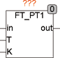

<!--
  Copyright (c) 2026 Hans Mühlbauer, Franz Höpfinger and others.

  This program and the accompanying materials are made available under the
  terms of the Eclipse Public License 2.0 which is available at
  https://www.eclipse.org/legal/epl-2.0

  SPDX-License-Identifier: EPL-2.0
-->

## Type	Function module

| | |
|:---|:---|
| **Input	IN** | REAL (input signal) |
| **T** | TIME (time constant) |
| **K** | REAL (multiplier) |
| **Output	OUT_MAX** | REAL (upper output limit) |
| | FT_PT1 is an LZI-  Transmission link  with a proportional transfer behavior 1 Order, even as a low pass filter 1 order referred to. The multiplier K sets the gain (multiplier) is fixed and T is the time constant.  A change at the input is attenuated at the output visible. The output signal increases within T to 63% of the input value and   after 3 * T to 95% of input values. Thus, after an abrupt change of the input signal of 0 to 10 at the time of the initial input change 0, increasing to 1 at T * 6.3 and after 3 * T 9.5 and then approaches asymptotically the value 10. The first time the output OUT to the IN input value is initialized to a defined starting performance guarantee. If the input T of T#0s is equal to the output OUT = K * IN. |

| **Structure diagram** |  |
| | Step response for T = 1, K = 1 |

