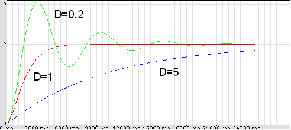

<!--
  Copyright (c) 2026 Hans Mühlbauer, Franz Höpfinger and others.

  This program and the accompanying materials are made available under the
  terms of the Eclipse Public License 2.0 which is available at
  https://www.eclipse.org/legal/epl-2.0

  SPDX-License-Identifier: EPL-2.0
-->

## Type	Function module

| | |
|:---|:---|
| **Input	IN** | REAL (input signal) |
| **T** | REAL (time constant) |
| **D** | REAL (damping) |
| **K** | REAL (multiplier) |
| **Output	OUT_MAX** | REAL (upper output limit) |
| | FT_PT2 is an LZI transfer module having a second transfer characteristic proportional order, even as a low pass filter 2 order known. The multiplier K sets the gain (multiplier),  T and D the time constant and the damping. If the input T of T#0s is equal to the output OUT = K * IN. |
| **The corresponding functional relationship in the time windows is given by the following differential equation** |  |
| | T² * OUT''(T) + 2 * D* T * OUT'(T) + OUT(T) = K * in(T). |
| **Structure diagram** |  |
| | Step response for T = 1, K = 2, D = 0,2 / 1 / 5 |

