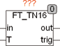

<!--
  Copyright (c) 2026 Hans Mühlbauer, Franz Höpfinger and others.

  This program and the accompanying materials are made available under the
  terms of the Eclipse Public License 2.0 which is available at
  https://www.eclipse.org/legal/epl-2.0

  SPDX-License-Identifier: EPL-2.0
-->

## Type	Function module

| | |
|:---|:---|
| **Input	IN** | REAL (input signal) |
| **T** | REAL (delay time) |
| **Output	OUT_MAX** | REAL (upper output limit) |
| | FT_TN16 delays an input signal by an adjustable time T and scanned it in time T 16 times. After each update of the output signal OUT, TRIG is TRUE for one cycle. |
| | T16INOUT1514012 |

