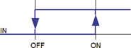
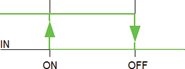

<!--
  Copyright (c) 2026 Hans Mühlbauer, Franz Höpfinger and others.

  This program and the accompanying materials are made available under the
  terms of the Eclipse Public License 2.0 which is available at
  https://www.eclipse.org/legal/epl-2.0

  SPDX-License-Identifier: EPL-2.0
-->

## Type	Function module

| | |
|:---|:---|
| **Input	IN** | REAL (input value) |
| **ON** | REAL (upper threshold) |
| **OFF** | REAL (lower threshold) |
| **Output	Q** | BOOL (output) |
| **WIN** | BOOL (shows that lies in between ON and OFF) |
| | HYST is a standard Hysteresis module, its function depends on the input values ON and OFF. |
| | Is ON > OFF then the output TRUE if IN > ON and is FALSE when IN < OFF. |
| | Is ON < OFF then the output TRUE if IN < ON and is FALSE when IN > OFF. |
| | The output WIN is TRUE if IN is between ON and OFF, is IN is out of range ON - OFF WIN gets FALSE. |

