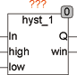
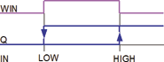
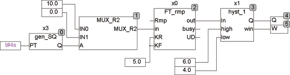

<!--
  Copyright (c) 2026 Hans Mühlbauer, Franz Höpfinger and others.

  This program and the accompanying materials are made available under the
  terms of the Eclipse Public License 2.0 which is available at
  https://www.eclipse.org/legal/epl-2.0

  SPDX-License-Identifier: EPL-2.0
-->

## Type	Function module

| | |
|:---|:---|
| **Input	IN** | REAL (input value) |
| **HIGH** | REAL (upper threshold) |
| **LOW** | REAL (lower threshold) |
| **Output	Q** | BOOL (output) |
| **WIN** | BOOL (shows that IN in between LOW and HIGH) |
| | HYST_1 is a hysteresis module that works with upper and lower limit. The output Q is only true if the input signal at IN has exceeded the value HIGH. It is then held true until the input signal falls below LOW and Q gets FALSE. A further output WIN indicates whether the input signal is between LOW and HIGH. |
| | The following example shows a triangular wave generator with downstream hysteresis  hysteresis module HYST_1. |
| | The green line shows the input signal, red is the output hysteresis and blue  the  WIN. |

