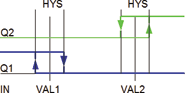

<!--
  Copyright (c) 2026 Hans Mühlbauer, Franz Höpfinger and others.

  This program and the accompanying materials are made available under the
  terms of the Eclipse Public License 2.0 which is available at
  https://www.eclipse.org/legal/epl-2.0

  SPDX-License-Identifier: EPL-2.0
-->

## Type	Function module

| | |
|:---|:---|
| **Input	IN** | REAL (input value) |
| **HYST** | REAL (width of hysteresis) |
| **VAL1** | REAL (mean of the hysteresis 1) |
| **VAL2** | REAL (mean of the hysteresis 2) |
| **Output	Q1** | BOOL (Output 1) |
| **Q2** | BOOL (Output 2) |
| | HYST_3 is a three-point controller. The three-point controller consists of two hysteresis. Q1 is a hysteresis with val1 as the threshold and HYST as hysteresis. Q1 is TRUE when IN is less than VAL1 - HYST / 2 and   FALSE when IN is greater than VAL1 + HYST / 2 . Q2 is analogous to val2. The three-point controller is used at all when motorized valves are controlled, which then be controlled with Q1r fo on and Q2 for off. If the value of IN between val1 and val2 both outputs are FALSE and the engine still stops. |
| **Following  Example  shows the waveform of a 3-point controller** |  |

