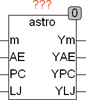

<!--
  Copyright (c) 2026 Hans Mühlbauer, Franz Höpfinger and others.

  This program and the accompanying materials are made available under the
  terms of the Eclipse Public License 2.0 which is available at
  https://www.eclipse.org/legal/epl-2.0

  SPDX-License-Identifier: EPL-2.0
-->

## Type	Function module

| | |
|:---|:---|
| **Input	M** | REAL (distance in meter) |
| **AE** | REAL (distance in astronomical units) |
| **PC** | REAL (distance in parsecs) |
| **LJ** | REAL (distance in light years) |
| **Output	YM** | REAL (distance in meters) |
| **YAE** | REAL (distance in astronomical units) |
| **YPC** | REAL (distance in parsecs) |
| **YLJ** | REAL (distance in light years) |
| | The module  ASTRO  converts  various distance units commonly used in astronomy. Normally, only the input to be converted is occupied and the remaining inputs remain free. However, if several inputs loaded with values, the values of all inputs are converted accordingly and then summed. |
| | 1 AE = 149,597870 * 109 m |
| | 1 PC = 206265 AE |
| | 1 LJ = 9,460530 * 1015 m = 63240 AE = 0,30659 PC |

