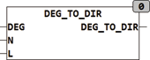

<!--
  Copyright (c) 2026 Hans Mühlbauer, Franz Höpfinger and others.

  This program and the accompanying materials are made available under the
  terms of the Eclipse Public License 2.0 which is available at
  https://www.eclipse.org/legal/epl-2.0

  SPDX-License-Identifier: EPL-2.0
-->

## Type	Function: STRING(3)

| | |
|:---|:---|
| **Input	DEG** | INT (direction in degrees) |
| **N** | INT (Maximum length of string) |
| **L** | INT (language: see language definition) |
| **Output** | STRING(3) (compass readings) |
| **DEG_TO_DIR calculates a direction (0 .360 degrees) into to compass readings. At the input DEG the direction in degrees is available (0 = North, 90 = East, 180 = South and 270 =  West  ). The output represents the direction as  String  NNE. With the input N the maximum length of the direction indication is limited. When N = 1, only in the 4 cardinal directions N, E, S, W dissolved. If N = 2 between each another direction is inserted** | NE, SE, SW, NW. At N = 3 are also directions as NNO ... are dissolved, with N = 3 a total of 16 directions are evaluated. The input L allows the switching of the languages defined in the language setup. 0L = 0 means  Default  Language, a number > 0 is one of the predefined languages. more info about the pre-defined data types can be found at [CONSTANTS_LANGUAGE](../../Data Types/constants_language.md). |

