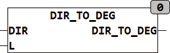

<!--
  Copyright (c) 2026 Hans Mühlbauer, Franz Höpfinger and others.

  This program and the accompanying materials are made available under the
  terms of the Eclipse Public License 2.0 which is available at
  https://www.eclipse.org/legal/epl-2.0

  SPDX-License-Identifier: EPL-2.0
-->

## Type	Function: INT

| | |
|:---|:---|
| **Input	DIR** | STRING(3) (direction in compass readings) |
| **L** | INT (language selection) |
| **Output** | INT (direction in degrees) |
| | DIR_TO_DEG converts a NNE direction in the form to degrees. It will be up to 3 points evaluated, corresponding to a resolution of 22.5°. The output is integer. The input must be in capital letters and East must be marked with O or E. The string NO is converted to 45°. L specifies the used language, for detailed information see data type [CONSTANTS_LANGUAGE](../../Data Types/constants_language.md). |
| **The cardinal points are** | 0° = North, 90° = East, 180° = South, 270° = West. The conversion is done according to the following table: |

| N | 0° | NNO, NNE | 23° | NO | 45° | ONO, ENE | 68° |
| --- | --- | --- | --- | --- | --- | --- | --- |
| O | 90° | OSO, ESE | 113° | SO, SE | 135° | SSO, SSE | 158° |
| S | 180° | SSW | 203° | SW | 225° | WSW | 248° |
| W | 270° | WNW | 293° | NW | 315° | NNW | 338° |
