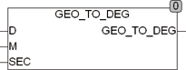

<!--
  Copyright (c) 2026 Hans Mühlbauer, Franz Höpfinger and others.

  This program and the accompanying materials are made available under the
  terms of the Eclipse Public License 2.0 which is available at
  https://www.eclipse.org/legal/epl-2.0

  SPDX-License-Identifier: EPL-2.0
-->

## Type 	Function: REAL

| | |
|:---|:---|
| **Input	D** | INT (angle in degrees) |
| **M** | INT (arc minutes) |
| **SEC** | REAL (arc seconds) |
| **Output** | REAL (angle specified in decimal degrees) |
| | GEO_TO_DEG calculates an angle expressed in degrees from the input data level. Minutes, seconds. |
| | GEO_TO_DEG (2,59,60.0) is 3.0 degrees |

