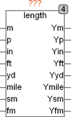

<!--
  Copyright (c) 2026 Hans Mühlbauer, Franz Höpfinger and others.

  This program and the accompanying materials are made available under the
  terms of the Eclipse Public License 2.0 which is available at
  https://www.eclipse.org/legal/epl-2.0

  SPDX-License-Identifier: EPL-2.0
-->

## LENGTH

| | |
|:---|:---|
| **Type** | Function module |
| **Input	M** | REAL (Meter) |
| **P** | REAL (Typographic point) |
| **IN** | REAL (Inch) |
| **FT** | REAL (Foot) |
| **YD** | REAL (Yard) |
| **MILE** | REAL (Mile) |
| **SM** | REAL (International nautical mile) |
| **FM** | REAL (Fathom) |
| **Output	YM** | REAL (Meter) |
| **YP** | REAL (Typographic point) |
| **YIN** | REAL (Inch) |
| **YFT** | REAL (  Foot  ) |
| **YYD** | REAL (Yard) |
| **YMILE** | REAL (Mile) |
| **YSM** | REAL (International nautical mile) |
| **YFM** | REAL (Fathom) |
| | The module LENGTH converts different in common used  units for units of length. Normally, only the input to be converted is occupied and the remaining inputs remain free. However, if several inputs loaded with values, the values of all inputs are converted accordingly and then summed. |
| | 1 P = 0.376065 mm (unit from the printing industry) |
| | 1 IN = 25,4 mm |
| | 1 FT = 0,3048 m |
| | 1 YD = 0,9144 m |
| | 1 MILE = 1609,344 m |
| | 1 SM = 1852 m |
| | 1 FM = 1,829 m |

