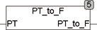

<!--
  Copyright (c) 2026 Hans Mühlbauer, Franz Höpfinger and others.

  This program and the accompanying materials are made available under the
  terms of the Eclipse Public License 2.0 which is available at
  https://www.eclipse.org/legal/epl-2.0

  SPDX-License-Identifier: EPL-2.0
-->

## PT_TO_F

| | |
|:---|:---|
| **Type	Function** | REAL |
| **Input	PT** | TIME (period in seconds) |
| **Output** | REAL (frequency in Hz) |
| | PT_TO_F expects a period of seconds in the appropriate frequency to frequency in Hz. |

