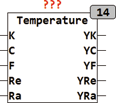

<!--
  Copyright (c) 2026 Hans Mühlbauer, Franz Höpfinger and others.

  This program and the accompanying materials are made available under the
  terms of the Eclipse Public License 2.0 which is available at
  https://www.eclipse.org/legal/epl-2.0

  SPDX-License-Identifier: EPL-2.0
-->

## Type	Function module

| | |
|:---|:---|
| **Input	K** | REAL (  Kelvin temperature scale for  ) |
| **C** | REAL (  Temperature scale to Celsius  ) |
| **F** | REAL (Fahrenheit temperature scale) |
| **RE** | REAL (after Reaumur temperature scale) |
| **RA** | Real (after Rankine temperature scale) |
| **Output	YK** | REAL (according to Kelvin temperature scale) |
| **YC** | REAL (  Temperature scale to Celsius  ) |
| **YF** | REAL (Fahrenheit temperature scale) |
| **YRE** | REAL (after Reaumur temperature scale) |
| **YRA** | Real (after Rankine temperature scale) |
| | The module TEMP converts different, in practice common used units for temperature. Normally, only the input to be converted is occupied and the remaining inputs remain free. However, if several inputs loaded with values, the values of all inputs are converted accordingly and then summed. |
| | 1 K = 273.15 °C |
| | 1 °C = 273.15 K |
| | 1 °F = °C * 1.8 + 32 |
| | 1 Re = °C * 0.8 |
| | 1 Ra = K * 1.8 |

