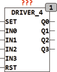

<!--
  Copyright (c) 2026 Hans Mühlbauer, Franz Höpfinger and others.

  This program and the accompanying materials are made available under the
  terms of the Eclipse Public License 2.0 which is available at
  https://www.eclipse.org/legal/epl-2.0

  SPDX-License-Identifier: EPL-2.0
-->

## DRIVER_4

| | |
|:---|:---|
| **Type** | Function module |
| **Input	SET** | BOOL (asynchronous set input) |
| **IN0...IN3** | BOOL (switching inputs) |
| **RST** | BOOL (asynchronous reset input) |
| **Output	Q0 .. Q3** | BOOL (outputs) |
| | DRIVER_1 is a driver module whose outputs Q can be switched by the inputs IN. a detailed description of the module can be read under DRIVER_1. DRIVER_4, as opposed to DRIVER_1 has 4 switching outputs, but otherwise has the same functionality. |
| **Setup	TOGGLE_MODE** | BOOL (mode of the input IN) |
| **TIMEOUT** | TIME (Maximum Ontime of outputs) |

