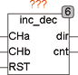
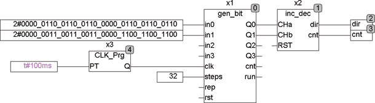

<!--
  Copyright (c) 2026 Hans Mühlbauer, Franz Höpfinger and others.

  This program and the accompanying materials are made available under the
  terms of the Eclipse Public License 2.0 which is available at
  https://www.eclipse.org/legal/epl-2.0

  SPDX-License-Identifier: EPL-2.0
-->

## Type	Function module

| | |
|:---|:---|
| **Input	CHA** | BOOL (channel A of sender) |
| **CHB** | BOOL (channel B of sender) |
| **RST** | BOOL (Reset) |
| **Output	DIR** | BOOL (rotation) |
| **CNT** | INT (counter value) |
| | INC_DEC is a decoder for incremental encoder. Encoder (rotation encoder) deliver two overlapping pulses, channel A and channel B. By the two channels, the direction and angle of rotation is decoded. INC_DEC detect each edge of the encoder, so 4 times the resolution is achieved. The output DIR shows the direction of rotation, and at the output CNT is an integer value provided, which outputs the number of counted pulses. For a full rotation of an encoder with 100 pulses CNT counts to 400, because each edge is counted at both channels, so 4 times the resolution is achieved. A RST input allows any time to set the counter to 0. The counter counts up when DIR = TRUE, and down if DIR = FALSE. |
| | In the following  Example  a pattern generator GEN_BIT is used to simulate a rotary encoder, which is always makes just 3 steps clockwise and 3 counterclockwise . In the  Trace RECORDING is shown how the INC_DEC split the movement in 12 steps and decodes the direction. |

