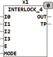

<!--
  Copyright (c) 2026 Hans Mühlbauer, Franz Höpfinger and others.

  This program and the accompanying materials are made available under the
  terms of the Eclipse Public License 2.0 which is available at
  https://www.eclipse.org/legal/epl-2.0

  SPDX-License-Identifier: EPL-2.0
-->

## Type	Function module

| | |
|:---|:---|
| **Input	I0** | BOOL (Input 0) |
| **I1** | BOOL (input signal 1) |
| **I2** | BOOL (input signal 2) |
| **I3** | BOOL (input signal 3) |
| **E** | BOOL (  Enable  Input) |
| **MODE** | INT (operating mode) |
| **Output	OUT** | BOOL (output) |
| **TP** | BOOL (TRUE if the departure has changed) |
| | INTERLOCK_4 stores the 4 input values I0..I3 in the bits (0..3) of the output OUT. With every change of the output the output TP is  for one cycle TRUE so that additional modules can be triggered for processing. If the input E = FALSE, all outputs remain to 0 or FALSE. The input MODE  adjust the different operating modes of the module. |

| MODE | Meaning |
| --- | --- |
| 0 | Inputs are directly passed to the output byte.z.B. I0, I2 = TRUE	OUT = 2#0000_0101 |
| 1 | Only the input with the highest input number is issued, the others are ignored.z.B. I0,I1,I2 = TRUE:	OUT = 2#0000_0100 |
| 2 | Only the most recently activated input is passed. |
| 3 | An enabled input  disables  all other inputs. |
