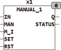

<!--
  Copyright (c) 2026 Hans Mühlbauer, Franz Höpfinger and others.

  This program and the accompanying materials are made available under the
  terms of the Eclipse Public License 2.0 which is available at
  https://www.eclipse.org/legal/epl-2.0

  SPDX-License-Identifier: EPL-2.0
-->

## MANUAL_1

| | |
|:---|:---|
| **Type** | Function module |
| **Input	IN** | BOOL (Input) |
| **MAN** | BOOL (manual override) |
| **M_i** | BOOL (signal level in manual mode) |
| **SET** | BOOL (Asynchronous set in manual mode) |
| **RST** | BOOL (Asynchronous reset for manual operation) |
| **Output	Q** | BOOL (output) |
| **STATUS** | BYTE (ESR compliant status output) |
| | MANUAL_1 can override a digital signal in the manual mode. As long as MAN = FALSE  the output Q  follows the input IN directly. Once MAN = TRUE, the output follows the state of the input M_I. With the inputs of SET and RST in manual mode, an asynchronous set and clear the output can be produced. SET and RST are active only during manual operation. Is in manual mode at SET or RST a rising edge, the output follows not longer the input M_I but remains on the state of the rising edge of SET (output = TRUE) or RST (output = FALSE). Once the input MAN is back on FALSE the output Q follows the input IN again. |

