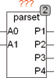

<!--
  Copyright (c) 2026 Hans Mühlbauer, Franz Höpfinger and others.

  This program and the accompanying materials are made available under the
  terms of the Eclipse Public License 2.0 which is available at
  https://www.eclipse.org/legal/epl-2.0

  SPDX-License-Identifier: EPL-2.0
-->

## Parset

| | |
|:---|:---|
| **Type** | Function module |
| **Input	A0** | BOOL (selection input 0) |
| **A1** | BOOL (selection input 1) |
| **Output	P1** | REAL (parameter 1 out) |
| **P2** | REAL (Parameter 2 Output) |
| **P3** | REAL (Parameter 3 Output) |
| **P4** | REAL (Parameter 4 Output) |
| | Parset selects from up to 4 sets of parameters each one and returns the values at the outputs P1 to P4. The values for the parameter sets are defined with the setup variables. If the TC setup variable to a value > 0 is set, the outputs do not change abruptly to a new value, but run in a ramp   to the new value so that the final value is reached after time TC. This allows the smooth transition between different sets of parameters. The choice of parameters is controlled by inputs A0 and A1. |
| **Setup	X01, X11, X21, X31** | REAL (values for parameters P1) |
| **X02, X12, X22, X32** | REAL (values for parameters P2) |
| **X03, X13, X23, X33** | REAL (values for parameters P3) |
| **X04, X14, X24, X34** | REAL (values for parameters P4) |
| **TC** | TIME (ramp time to a new value of the) |

| A1,A0 | P1 | P2 | P3 | P4 |
| --- | --- | --- | --- | --- |
| 00 | X01 | X02 | X03 | X04 |
| 01 | X11 | X12 | X13 | X14 |
| 10 | X21 | X22 | X23 | X24 |
| 11 | X31 | X32 | X33 | X34 |
