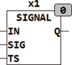

<!--
  Copyright (c) 2026 Hans Mühlbauer, Franz Höpfinger and others.

  This program and the accompanying materials are made available under the
  terms of the Eclipse Public License 2.0 which is available at
  https://www.eclipse.org/legal/epl-2.0

  SPDX-License-Identifier: EPL-2.0
-->

## Type	Function module

| | |
|:---|:---|
| **Input	IN** | BOOL (enable input) |
| **SIG** | BYTE (Bitpattern) |
| **TS** | TIME (switching time) |
| **Output	Q** | BOOL (output) |
| | SIGNAL generates an output signal Q that corresponds to the bit pattern in SIG. This is Bitpattern is passed in TS long steps. By different bit patterns in SIG, various output signals are generated. If the input IN connected to TRUE, the module begins to put on output Q in accordance with the SIG provided Bitpattern . By adapting the Bitpattern different output signals are generated. A  Pattern  of 10101010, generates an output signal with 50%  Duty  Cycle  and a frequency that is 1/2*S. A  Pattern  11110000 by contrast, generates an output signal of 50%  and a frequency of 1/8*TS. The start of an output signal is random. The  Bit sequence  starts at any bit when the input IN goes to TRUE. If at the input TS no time given then the module internally uses a default of 1024ms per cycle (a cycle is the cycle of all 8 bits of a sequence). Typical applications for SIGNAL is the signal generation for sirens or signal lamps. |
| | The following graph illustrates the functioning of signal for |
| **SIG = 2#1111_0000** |  |

