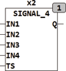

<!--
  Copyright (c) 2026 Hans Mühlbauer, Franz Höpfinger and others.

  This program and the accompanying materials are made available under the
  terms of the Eclipse Public License 2.0 which is available at
  https://www.eclipse.org/legal/epl-2.0

  SPDX-License-Identifier: EPL-2.0
-->

## Type	Function module

| | |
|:---|:---|
| **Input	IN1..IN4** | BOOL (input for Bitpattern S1..S4) |
| **TS** | TIME (switching time) |
| **Output	Q** | BOOL (output) |
| | SIGNAL_4 generates an output signal Q that is equivalent the one of 4 Bitpattern (S1.. S4). This is Bitpattern is passed in TS long steps. The inputs IN1..IN4 inputs are prioritized. A TRUE at  IN1 overrides all other inputs, IN2 overwrite IN3 and IN4 has the lowest priority. A detailed description of the function of SIGNAL_4 is under SIGNAL. The 4 different Bitpattern are in setup variables are in S1.. S4 and can be adjusted by the user at any time. |
| **The module has the following default by Bitpattern, but can be changed by the user if required** |  |
| | S1 = 2#1111_1111 |
| | S2 = 2#1111_0000 |
| | S3 = 2#1010_1010 |
| | S4 = 2#1010_0000 |
| **Setup	S1.. S4** | BYTE (Bitpattern S1 .. S4) |

