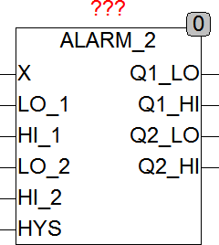

<!--
  Copyright (c) 2026 Hans Mühlbauer, Franz Höpfinger and others.

  This program and the accompanying materials are made available under the
  terms of the Eclipse Public License 2.0 which is available at
  https://www.eclipse.org/legal/epl-2.0

  SPDX-License-Identifier: EPL-2.0
-->

## Type	Function module

| | |
|:---|:---|
| **Input	X** | REAL (input) |
| **RST** | BOOL (reset input for alarm output) |
| **Output	LOW** | BOOL (TRUE, if X < TRIGGER_LOW) |
| | ALARM_2 examine whether X exceeds up the limits HI_1 or HI_2 and relies on the outputs Q1_HI or Q2_HI TRUE. If the limits  LO_2 or LO_1 are below, it set Q1_LO or Q2_LO to TRUE. The outputs will remain TRUE as the corresponding limit over-or under-rature. To prevent a flutter of the outputs alternatively a  Hysteresis HYS may be set. HYS is set to a value > 0, then the corresponding output is set only when the limit is exceeded  or below by more than HYS/2. Accordingly, the input X is the limit by more than HYS/2 on or before exceeding the corresponding outputs are deleted. |
| | ALARM_2 for example, with HI_1 and LO_1 can control the level of a liquid container and with HI_2 and LO_2 trigger an alarm when a critical level is exceeded or below. |

