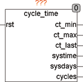

<!--
  Copyright (c) 2026 Hans Mühlbauer, Franz Höpfinger and others.

  This program and the accompanying materials are made available under the
  terms of the Eclipse Public License 2.0 which is available at
  https://www.eclipse.org/legal/epl-2.0

  SPDX-License-Identifier: EPL-2.0
-->

## Type	Function module

| | |
|:---|:---|
| **Input	RES** | BOOL (Reset) |
| **Output	CT_MIN** | TIME (minimum measured cycle time) |
| **CT_MAX** | TIME (maximum measured cycle time) |
| **CT_LAST** | TIME (recently measured cycle time) |
| **SYSTIME** | TIME (duration since last	start) |
| **SYSDAYS** | INT (number of days since last start) |
| **CYCLES** | DWORD (number of cycles since the last start) |
| | CYCLE_TIME monitors the cycle time of a PLC and provides the user with a range of information about cycle times and run times. The total number of cycles is also measured. Hereby, the user can, for example ensure that a function is called every 100 cycles. Control modules can report errors if the cycle time is too long and therefore the control parameters can not be guaranteed. |

