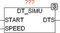

<!--
  Copyright (c) 2026 Hans Mühlbauer, Franz Höpfinger and others.

  This program and the accompanying materials are made available under the
  terms of the Eclipse Public License 2.0 which is available at
  https://www.eclipse.org/legal/epl-2.0

  SPDX-License-Identifier: EPL-2.0
-->

## Type	Function module

| | |
|:---|:---|
| **Input** | START DT (start DATETIME) |
| **SPEED** | REAL (speed for the output DTS) |
| **Output	DTS** | DT (Simulated DATE TIME) |
| | DT_SIMU simulates on output DTS a date value that starts with the initial value of START and continues with the speed SPEED. If SPEED intthe input value not used, the device operates with the internal standard value 1.0 and the DTS output is running forward at 1 second/second. With the input SPEED at the output DTS an arbitrarily fast or slow clock can be simulated. The module can be used in the simulation environment to simulate an RTC and also adjust the speed of the RTC for testing. If the input SPEED = 0, the output DTS at each PLC cycle is further increased by a second. |

