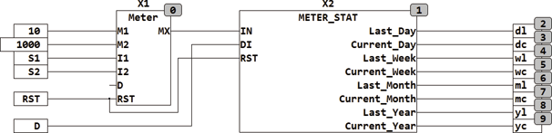

<!--
  Copyright (c) 2026 Hans Mühlbauer, Franz Höpfinger and others.

  This program and the accompanying materials are made available under the
  terms of the Eclipse Public License 2.0 which is available at
  https://www.eclipse.org/legal/epl-2.0

  SPDX-License-Identifier: EPL-2.0
-->

## Type	Function module

| | |
|:---|:---|
| **Input	IN** | REAL (input signal) |
| **DI** | DATE (date input) |
| **RST** | BOOL (Reset input) |
| **I / O	LAST_DAY** | REAL (consumption value of the previous day) |
| **CURRENT_DAY** | REAL (consumption value of the current day) |
| **LAST_WEEK** | REAL (consumption value over the past week) |
| **CURRENT_WEEK** | REAL (consumption value of the current week) |
| **LAST_MONTH** | REAL (consumption value of the last month) |
| **CURRENT_MONTH** | REAL (consumption of the current month) |
| **LAST_YEAR** | REAL (consumption value of last year) |
| **Current_year** | REAL (consumption value of the current year) |
| | METER_STAT calculates the consumption of the current day, week, month and year and shows the value of the last corresponding period. The accumulated consumption value is at the IN input, while at the DI input is applied the current date. With the RST input, the counter can be reset at any time. For ease of storage in the persistent and retentive memory, the outputs are defined as I / O. |
| **The following example shows the application of METER_STAT with the module METER** |  |

