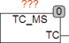

<!--
  Copyright (c) 2026 Hans Mühlbauer, Franz Höpfinger and others.

  This program and the accompanying materials are made available under the
  terms of the Eclipse Public License 2.0 which is available at
  https://www.eclipse.org/legal/epl-2.0

  SPDX-License-Identifier: EPL-2.0
-->

## Type	Function module

| | |
|:---|:---|
| **Output	TC** | DWORD (last cycle time in milliseconds) |
| | TC_MS determines the last cycle time, that is the time since the last call of the module has passed. The time comes in milliseconds. |

