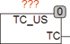

<!--
  Copyright (c) 2026 Hans Mühlbauer, Franz Höpfinger and others.

  This program and the accompanying materials are made available under the
  terms of the Eclipse Public License 2.0 which is available at
  https://www.eclipse.org/legal/epl-2.0

  SPDX-License-Identifier: EPL-2.0
-->

## Type	Function module

| | |
|:---|:---|
| **Output	TC** | DWORD (last cycle time in milliseconds) |
| | TC_US determines the last cycle time, that is the time since the last call of the module has passed. The time comes in milliseconds. The module calls the function T_PLC_US(). T_PLC_US () returns the internal PLC  Timer  in microseconds with a step width of 1000 microseconds. If a higher resolution is required the function T_PLC_US() has to be adjusted to the appropriate system. |

