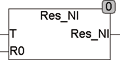

<!--
  Copyright (c) 2026 Hans Mühlbauer, Franz Höpfinger and others.

  This program and the accompanying materials are made available under the
  terms of the Eclipse Public License 2.0 which is available at
  https://www.eclipse.org/legal/epl-2.0

  SPDX-License-Identifier: EPL-2.0
-->

## RES_NI

| | |
|:---|:---|
| **Type	Function** | REAL |
| **Input	T** | REAL (temperature in °C) |
| **R0** | REAL (resistance at 0° C) |
| **Output** | REAL (resistance) |
| | RES_NI calculated the resistance of a NI-resistance sensor from the input values T (temperature in°C) and R0 (resistance at 0°C). |
| **The calculation is done using the formula** |  |
| | RES_NI = R0 + A*T + B*T²+C*T4 |
| | A = 0.5485 |
| | B = 0.665E-3 |
| | C = 2.805E-9 |
| | The calculation is suitable for temperatures from -60.. +180 °C. |

