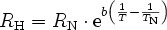

<!--
  Copyright (c) 2026 Hans Mühlbauer, Franz Höpfinger and others.

  This program and the accompanying materials are made available under the
  terms of the Eclipse Public License 2.0 which is available at
  https://www.eclipse.org/legal/epl-2.0

  SPDX-License-Identifier: EPL-2.0
-->

## RES_NTC

| | |
|:---|:---|
| **Type	Function** | REAL |
| **Input	T** | REAL (temperature in °C) |
| **RN** | REAL (resistance at 25°C) |
| **B** | REAL (characteristic value of the sensor) |
| **Output** | REAL (resistance) |
| | RES_NTC calculated the resistance of an NTC resistance sensor from the input values T (temperature in °C) and RN (resistance at 25°C). The input value B is a constant value which must be read in the data sheets of that sensor. Typical values are at NTC sensors 2000 - 4000 Kelvin. |
| **The calculation is done using the formula** |  |
| | The formula provides a sufficient accuracy for small temperature ranges, eg 0-100°C. For wide temperature ranges the formula according to Steinhart is more suitable. |

