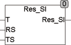

<!--
  Copyright (c) 2026 Hans Mühlbauer, Franz Höpfinger and others.

  This program and the accompanying materials are made available under the
  terms of the Eclipse Public License 2.0 which is available at
  https://www.eclipse.org/legal/epl-2.0

  SPDX-License-Identifier: EPL-2.0
-->

## Type	Function: REAL

| | |
|:---|:---|
| **Input	T** | REAL (temperature in °C) |
| **RS** | REAL (Resistance at TS °C) |
| **TS** | REAL (temperature at RS) |
| **Output** | REAL (resistance) |
| | RES_SI calculates the resistance of a SI-resistance sensor from the input values T (temperature in °C) and RS, resistance at TS in °C. In contrast to the modules RES_NI and RES_PT which R0 is given at 0°C, the resistance specified for RS for SI sensors at different temperatures (eg 25°C for KTY10). Therefore, the module has an input for RS and another for TS. |
| **The calculation is done using the formula** |  |
| | RES_SI = RS + A*(T-TS) + B*(T-TS)² |
| | A = 7.64E-3 |
| | B = 1.66E-5 |
| | The calculation is suitable for a temperature range of -50 .. +150°C. |

