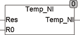
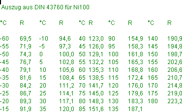

<!--
  Copyright (c) 2026 Hans Mühlbauer, Franz Höpfinger and others.

  This program and the accompanying materials are made available under the
  terms of the Eclipse Public License 2.0 which is available at
  https://www.eclipse.org/legal/epl-2.0

  SPDX-License-Identifier: EPL-2.0
-->

## Type	Function: REAL

| | |
|:---|:---|
| **Input	RES** | REAL (resistance in ohms) |
| **R0** | REAL (resistance at 0° C) |
| **Output** | REAL (measured temperature) |
| | RES_NI calculates the temperature of a NI-resistance from the RES sensor input values (measured resistance value) and R0 (resistance at 0°C). |
| **The calculation is suitable for a temperature range of -60.. +180 ° C and made by the following formal** |  |
| | RES_NI = R0 + A*T + B*T²+C*T4 |
| | A = 0.5485; B = 0.665E-3; C = 2.805E-9 |

