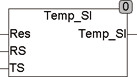

<!--
  Copyright (c) 2026 Hans Mühlbauer, Franz Höpfinger and others.

  This program and the accompanying materials are made available under the
  terms of the Eclipse Public License 2.0 which is available at
  https://www.eclipse.org/legal/epl-2.0

  SPDX-License-Identifier: EPL-2.0
-->

## Type	Function: REAL

| | |
|:---|:---|
| **Input	RES** | REAL (measured resistance in ohms) |
| **RS** | REAL (resistance at 0°C) |
| **TS** | REAL (temperature is defined in RS) |
| **Output** | REAL (measured temperature) |
| | TEMP_SI calculates the temperature of a resistor sensor input values from the RES (resistance in ohms) and RS, Resistance at TS in °C. It is specified in contrast to the modules TEMP_NI and TEMP_PT with their R0 at 0°, the resistance RS is given in SI sensors at different temperatures (eg 25° C for KTY10). Therefore, the module has an input for RS and another for TS. |
| **The calculation is done using the formula** |  |
| | RES_SI = RS + A*(T-TS) + B*(T-TS)² |
| | A = 7.64E-3; B = 1.66E-5 |
| | The calculation is suitable for temperatures from -50.. +150 °C. |

