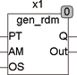
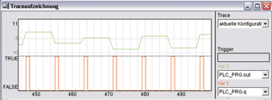

<!--
  Copyright (c) 2026 Hans Mühlbauer, Franz Höpfinger and others.

  This program and the accompanying materials are made available under the
  terms of the Eclipse Public License 2.0 which is available at
  https://www.eclipse.org/legal/epl-2.0

  SPDX-License-Identifier: EPL-2.0
-->

## Type	Function module

| | |
|:---|:---|
| **Input	PT** | TIME (period time) |
| **AM** | REAL (signal amplitude) |
| **OS** | REAL (signal offset) |
| **Output	Q** | BOOL (binary output) |
| **OUT** | REAL (analog output signal) |
| | GEN_RDM is a random signal generator. It generates the output OUT a new value in PT intervals. The output Q is TRUE for one cycle when the output OUT has changed. The input AM and OS set the amplitude and the offset for the output OUT. If the inputs OS and AM are not connected, then the default values are 0 and . |
| | The following example shows a trace recording of the input values PT = 100ms, AM = 10 and OS = 5. The output values generated every 100 ms in the range of 0 .. 10. |

