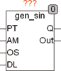
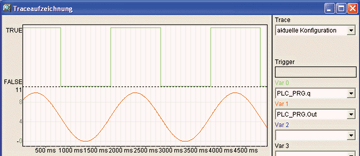

<!--
  Copyright (c) 2026 Hans Mühlbauer, Franz Höpfinger and others.

  This program and the accompanying materials are made available under the
  terms of the Eclipse Public License 2.0 which is available at
  https://www.eclipse.org/legal/epl-2.0

  SPDX-License-Identifier: EPL-2.0
-->

## Type	Function module

| | |
|:---|:---|
| **Input	PT** | TIME (period time) |
| **AM** | REAL (signal amplitude) |
| **OS** | REAL (signal offset) |
| **DL** | REAL (signal delay 0..1 * PT ) |
| **Output	Q** | BOOL (binary output) |
| **OUT** | REAL (analog output) |
| | GEN_SIN is a sine wave generator with programmable period, adjustable amplitude and signal offset. A special feature is a adjustable delay so that with multiple generators overlapping signals can be generated. A Binary Output Q passes a logical signal, which is generated phase equal to the sine signal. The input DL is a delay for the output signal. The  Delay  is specified with DL * PT. A DL of 0.5 delays the signal by half a period. |
| | The following example shows GEN_SIN with a trace recording of the sine signal and the binary output Q. |
| | The above example generates a sine wave with 0.1 Hz (PT = 10 s) and a lower peak value of 0 and upper peak value of 10. |

