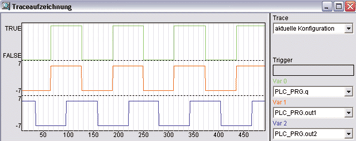
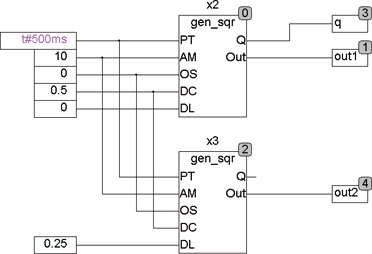

<!--
  Copyright (c) 2026 Hans Mühlbauer, Franz Höpfinger and others.

  This program and the accompanying materials are made available under the
  terms of the Eclipse Public License 2.0 which is available at
  https://www.eclipse.org/legal/epl-2.0

  SPDX-License-Identifier: EPL-2.0
-->

## Type	Function module

| | |
|:---|:---|
| **Input	PT** | TIME (period time) |
| **AM** | REAL (signal amplitude) |
| **OS** | REAL (signal offset) |
| **DC** | REAL (duty cycle 0..1) |
| **DL** | REAL (signal delay 0..1 * PT ) |
| **Output	Q** | BOOL (binary output) |
| **OUT** | REAL (analog output) |
| | GEN_SQR is a sqare wave generator with programmable period, adjustable amplitude and signal offset and duty cycle DC (  Duty  Cycle  ). A special feature is a adjustable delay so that with multiple generators overlapping signals can be generated. |
| | The following  Example  shows 2 GEN_SQR, one runs with a delay of 0.25 (¼ period). In the trace record clearly shows the signal of the first generator and the delayed signal of the second generator. |

