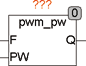

<!--
  Copyright (c) 2026 Hans Mühlbauer, Franz Höpfinger and others.

  This program and the accompanying materials are made available under the
  terms of the Eclipse Public License 2.0 which is available at
  https://www.eclipse.org/legal/epl-2.0

  SPDX-License-Identifier: EPL-2.0
-->

## Type	Function module

| | |
|:---|:---|
| **Input	F** | REAL (output frequency) |
| **PW** | TIME (pulse duration  high  ) |
| **Output	Q** | BOOL (output) |
| | PWM_PW is a pulse width modulated frequency generator. The generator generates a fixed frequency F with a duty cycle (TON / TOFF) which can bemodulated  (set) by the input PW. The input passes the time before the signal remains TRUE. |

