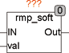
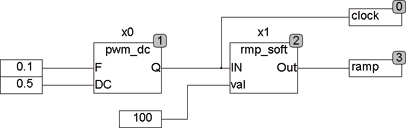

<!--
  Copyright (c) 2026 Hans Mühlbauer, Franz Höpfinger and others.

  This program and the accompanying materials are made available under the
  terms of the Eclipse Public License 2.0 which is available at
  https://www.eclipse.org/legal/epl-2.0

  SPDX-License-Identifier: EPL-2.0
-->

## RMP_SOFT

| | |
|:---|:---|
| **Type** | Function module |
| **Input	IN** | BOOL (enable input) |
| **VAL** | Byte (maximum output value) |
| **Output** | I/O |
| | RMP_SOFT smooths the ramp of an input signal VAL. The signal  Out  follows the input signal VAL, where  increase time as well as fall time can be limited  by PT_ON and PT_OFF . The rise time  and fall time of the ramps are defined by setup parameter in the module RMP_SOFT. The setup time PT_ON specifies how long the ramp takes of 0..255. A ramp that is limited by the VAL, is accordingly shorter. PT_OFF defines accordingly the falling ramp. If the input IN is set to FALSE, VAL corresponds to a value of 0, so by switching the input IN between 0 and VAL it can be switched. |
| **Setup	PT_ON** | TIME (rise time,  Default  is 100 ms) |
| **PT_OFF** | TIME (fall time;  Default  is 100 ms) |

**Example:**

Example:
