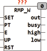

<!--
  Copyright (c) 2026 Hans Mühlbauer, Franz Höpfinger and others.

  This program and the accompanying materials are made available under the
  terms of the Eclipse Public License 2.0 which is available at
  https://www.eclipse.org/legal/epl-2.0

  SPDX-License-Identifier: EPL-2.0
-->

## RMP_W

| | |
|:---|:---|
| **Type** | Function module |
| **Input	SET** | BOOL (set input) |
| **PT** | TIME (duration of a ramp 0..65535) |
| **E** | BOOL (enable input) |
| **UP** | BOOL (direction UP = TRUE, means UP  ) |
| **RST** | BOOL (Reset input) |
| **Output** | I/O |
| **BUSY** | BOOL (TRUE, when ramp is running) |
| **HIGH** | BOOL (maximum output value is reached) |
| **LOW** | BOOL (Minimum output value is reached) |
| | RMP_W is a ramp generator with 16-bit (2 bytes) resolution. The ramp of 0.. 65535 is divided into a maximum of 65536 steps and run in a time of PT once complete. An enable signal E switches the ramp generator on or off. An asynchronous reset sets each time the output to 0, and a pulse at the Set input sets the output to 65535. With the UD input, the direction UP (UD = TRUE) or DOWN (UD = FALSE) is defined. The output of BUSY = TRUE indicates that a ramp is active. BUSY = FALSE means the output is stable. The outputs HIGH and LOW gets TRUE, the output OUT reaches the lower or upper limit (0 and 65535). |
| | At setting of PT is to be noted that a PLC with 5 ms cycle time needs  65536*5 = 327 seconds for a ramp. If the PT is the time defined shorter than the cycle time 65536, the edge is translated in correspondingly larger steps. The ramp is constructed in this case with less than 256 steps per cycle.  PT may be T#0s, then the output switched between minimum and maximum value back and forth. |
| | For a detailed description, see the module RMP_B. The function is absolutely identical except that the output OUT 8-bit wide instead of 16 bit. |

