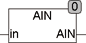

<!--
  Copyright (c) 2026 Hans Mühlbauer, Franz Höpfinger and others.

  This program and the accompanying materials are made available under the
  terms of the Eclipse Public License 2.0 which is available at
  https://www.eclipse.org/legal/epl-2.0

  SPDX-License-Identifier: EPL-2.0
-->

## Type	Function

| | |
|:---|:---|
| **Input	IN** | DWORD (input from the A / D converter) |
| **Output** | REAL (output value) |
| **Setup	BITS** | Bytes (number of bits, 16 for a complete word) |
| **SIGN** | Byte (  Sign  Bit, 15 for Bit 15) |
| **LOW** | REAL (minimum value of output) |
| **High** | REAL (largest value of output) |
| | Analog inputs of A / D converters generally provide a WORD (16 bit) or DWORD (32 bit), but they do not even usually 16 bit or 32 bit resolution. Furthermore A/D converter digitizing a fixed input range (z as -10 .. + 10 V), which for example, the digital values 0 .. 65535 (In 16-bit). The AIN function is configured by setup parameters and calculates the output values of the A/D converter according to, so that after the AIN module a REAL value is available, which corresponds to the real measured value. Furthermore, the module can extract and convert a  Sign-  Bit at any point. By double-clicking on the module, several setup variables can be defined. Bits defines how many bits of the input DWORD to be processed. For a 12 bit converter, this value is 12. Then only the bits 0 - 11 are scored.  Sign defines whether a sign bit is present and where it is found in the input word.  Sign = 255 means that no sign bit is present and 15 means that bit 15 in the DWORD contains the sign. The default value for SIGN is 255. LOW and HIGH define the smallest and largest output value. If a  Sign- Bit is defined ( SIGN < 255), then LOW and HIGH must be positive. Without  Sign- Bit they can be either positive or negative. |

**Example:**

Example: A 12-bit A/D converter without a sign and input range from 0-10 is defined as follows: Bits = 12,  Sign = 255, LOW = 0, HIGH = 10 A 14-bit A/D converter with 14 bits with sign and input range -10 - +10 is defined as: Bits = 14,  Sign = 14, Low = 0, HIGH = +10. A 24-bit A/D converter without sign and a input range -10 - +10 is defined as: Bits = 24,  Sign = 255, LOW =- 10, HIGH = +10.
