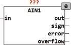
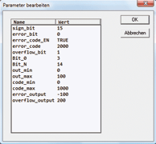

<!--
  Copyright (c) 2026 Hans Mühlbauer, Franz Höpfinger and others.

  This program and the accompanying materials are made available under the
  terms of the Eclipse Public License 2.0 which is available at
  https://www.eclipse.org/legal/epl-2.0

  SPDX-License-Identifier: EPL-2.0
-->

## Type	Function module

| | |
|:---|:---|
| **Input	IN** | DWORD (input from the A / D converter) |
| **Output	OUT** | REAL (output value) |
| **SIGN** | BOOL (sign) |
| **ERROR** | BOOL (  Error  Bit) |
| **OVERFLOW** | BOOL (  Overflow  Bit) |
| **Setup	SIGN_BIT** | INT (bit number of the sign) |
| **ERROR_BIT** | INT (bit number of error bits) |
| **ERROR_CODE_EN** | BOOL (evaluation of the  Error  A code) |
| **ERROR_CODE** | DWORD (error code of the input IN) |
| **OVERFLOW_BIT** | INT (bit number of Overflow  Bits) |
| **OVERFLOW_CODE_EN** | BOOL ( Overflow code evaluation enabled) |
| **OVERFLOW_CODE** | DWORD ( Overflow Code of input IN) |
| **BIT_0** | INT (least significant bit number of data bits) |
| **BIT_N** | INT (most significant bit number of data bits) |
| **OUT_MIN** | REAL (input value at CODE_MIN) |
| **OUT_MAX** | REAL (output value at CODE_MAX) |
| **CODE_MIN** | DWORD (Minimum input value) |
| **CODE_MAX** | DWORD (maximum input) |
| **ERROR_OUTPUT** | REAL (output value ERROR) |
| **OVERFLOW_OUTPUT** | REAL   (output value of OVERFLOW) |
| | AIN1 sets the digital output value of an A/D converter into a corresponding REAL value to the measured value. The device can be adjusted by setup variables to a variety of digital converters. |
| | A SIGN_BIT determines at which bit the D/A converter transmit the sign. When this variable is not defined or set to a value greater than 31 no sign is evaluated. The content of the SIGN_BIT appears at the output of SIGN. When a ERROR_BIT is specified, the contents of  Error Bits is displayed at the output ERROR. Some A/D converter supply instead of a Error Bit a fixed output value which is out of the specified range and is thus an error signaling. The setup variable ERROR_CODE specifies the corresponding Error Code and with the ERROR_CODE_EN the evaluation of error_code is defined. If ERROR = TRUE, at the output OUT the value of  ERROR_OUTPUT is issued. Using the OVERFLOW_BITS an over-range of the D/A converter is signaled and issued at the output OVERFLOW. Using the Setup variables OVERFLOW_CODE_EN and OVERFLOW_CODE it can query a certain code at the input IN and in the presence of this code, the Overflow Bits are set. Using CODE_MIN CODE_MAX in addition to OVERFLOW_BIT specifies an allowable range for the input data. Over-or under-steps this area will also set the OVERFLOW output. In an overflow the output value OVERFLOW_OUTPUT is at the output OUT. The setup variables BIT_0 BIT_N determine how the measured value by the D/A converter   is provided. With Bit_0 set is defined at which bit the data word begins and with BIT_N at which the bit data word ends. In the example above, the data word is transferred from bit 3 - bit 14 (Bit 3 = bit 0 of data word and bit 14 = bit 12 of data word). The received data word is converted according to the setup variables CODE_MIN, CODE_MAX and OUT_MIN, OUT_MAX and, if a sign is present and if SIGN = TRUE, the output value OUT is inverted. |

