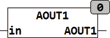
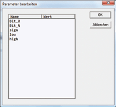

<!--
  Copyright (c) 2026 Hans Mühlbauer, Franz Höpfinger and others.

  This program and the accompanying materials are made available under the
  terms of the Eclipse Public License 2.0 which is available at
  https://www.eclipse.org/legal/epl-2.0

  SPDX-License-Identifier: EPL-2.0
-->

## Type	Function

| | |
|:---|:---|
| **Input	IN** | REAL (input value) |
| **Output** | DWORD (output word to the A/D converter) |
| **Setup	BIT_0** | INT (position of the lowest significant bit of data word) |
| **BIT_N** | INT (position of the most significant bits of data word) |
| **SIGN** | INT( Sign Bit, 15 for Bit 15) |
| **LOW** | REAL (smallest value of the input) |
| **HIGH** | REAL (largest value of input) |
| | AOUT1 generates from the REAL input value IN a digital output value for D/A converter or other modules of digital data. Using Setup variables, the digital output value can be adapted to different needs. The IN input value is converted using the information in LOW and HIGH and with the length specified in BIT_0 and BIT_N, and made available at the output. BIT_0 specifies the position of the lowest significant data bits (Bit0) in the output data and  BIT_N specifies the position of the most significant data bits in the output data. The length of the data area is automatically calculated by BIT_N - BIT_0 + 1. When the position of a sign bit is specified with SIGN  the sign of the input value is copied to the specified position of SIGN in the output data. |

