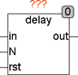
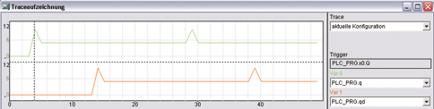

<!--
  Copyright (c) 2026 Hans Mühlbauer, Franz Höpfinger and others.

  This program and the accompanying materials are made available under the
  terms of the Eclipse Public License 2.0 which is available at
  https://www.eclipse.org/legal/epl-2.0

  SPDX-License-Identifier: EPL-2.0
-->

## Type	Function module

| | |
|:---|:---|
| **Input	IN** | REAL (input value) |
| **N** | INT (number of  delay  cycles) |
| **RST** | BOOL (asynchronous reset) |
| **Output	OUT** | REAL (delayed output value) |
| | DELAY delays an input signal (IN) for N cycles. The input RESET is asynchronous, and may delete the  Delay  buffer. |
| | The  Example  shows a generator that produces pulses of 5 to 10 and a  Delay,  that generates a 10 cycles delay. |

